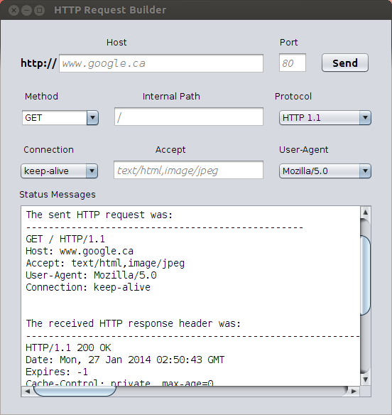

HTTPRequestBuilder
==================

##Description

The HTTP request builder is a java program that enable user to construct a customized HTTP request, send it to host  and receive the corresponding responses.

User defined field including host, port, HTTP method, internal path, HTTP protocol version, connection type, user-agent, accept.

##Files in this repo

I wrote this GUI program in Netbeans IDE. The HTTPRequestBuilder.zip is the zipped exported project from Netbeans IDE. 

The HTTPRequestBuilder.java is the core source code of this program. I also add it to this repo; so this program can also run in command line with the simple 
	
	$javac HTTPRequestBuilder.java 
	$java HTTPRequestBuilder

When you are going to make some changes to this program, I high recommend you to use an IDE, since it's hard to edit a GUI program in terminal.